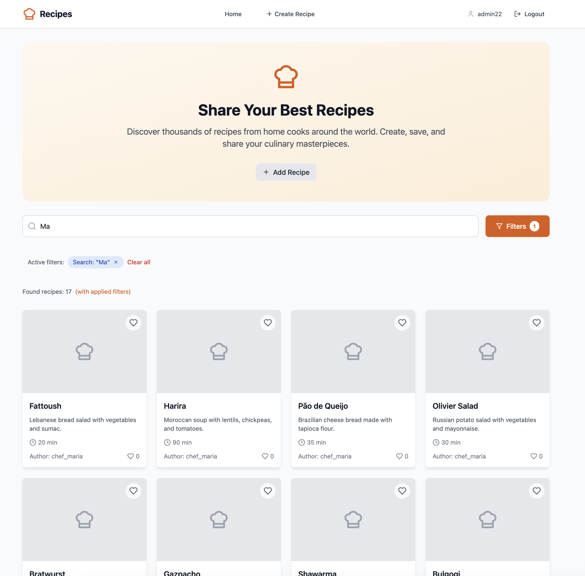

# Recipes Platform

A modern platform for creating, sharing, and discovering recipes with a beautiful user interface and powerful API.

## 🚀 Technologies

### Backend
- **NestJS** - modern Node.js framework
- **TypeScript** - typed JavaScript
- **Prisma ORM** - modern ORM for database operations
- **PostgreSQL** - reliable relational database
- **JWT** - authentication and authorization

### Frontend
- **React 18** - UI library
- **TypeScript** - typed JavaScript
- **Vite** - fast build tool
- **Tailwind CSS** - utility-first CSS framework
- **TanStack Router** - routing
- **TanStack Query** - server state management
- **Lucide React** - beautiful icons
- **Sonner** - toast notifications

### Infrastructure
- **Docker** - application containerization
- **Docker Compose** - container orchestration

## 📋 Requirements

- Docker
- Docker Compose
- Node.js 18+ (for local development)

## 🛠️ Quick Start

### 🚀 One Command Setup (Recommended)
**Clone the repository**
   ```bash
   git clone https://github.com/kirian-dev/recipes-app.git
   cd recipes-app
   ```
**For complete application setup with migrations, seeds and tests:**
```bash
./scripts/run-all.sh
```

**For quick application start only (without tests):**
```bash
./scripts/start-app.sh
```

**For running e2e tests only:**
```bash
./scripts/run-tests.sh
```

### Option 1: Docker (Manual)

1. **Clone the repository**
   ```bash
   git clone <repository-url>
   cd recipes-app
   ```

2. **Start all services**
   ```bash
   docker compose up --build
   ```

3. **Open the application**
   - Frontend: http://localhost:3000
   - Backend API: http://localhost:3001/api
   - Swagger Documentation: http://localhost:3001/api/docs
   - PostgreSQL: localhost:5432

### Option 2: Local Development

1. **Start the database**
   ```bash
   docker compose up postgres -d
   ```

2. **Setup backend**
   ```bash
   cd backend
   npm install
   npm run db:init
   npm run db:seed
   npm run start:dev
   ```

3. **Setup frontend**
   ```bash
   cd frontend
   npm install
   npm run dev
   ```

## 📁 Project Structure

```
recipes-app/
├── backend/                 # NestJS API
│   ├── src/
│   │   ├── auth/           # Authentication module
│   │   ├── recipes/        # Recipes module
│   │   ├── analytics/      # Analytics module
│   │   ├── common/         # Common components
│   │   └── app.module.ts   # Main module
│   ├── prisma/
│   │   ├── schema.prisma   # Database schema
│   │   └── seed.ts         # Test data seeder
│   └── Dockerfile
├── frontend/               # React application
│   ├── src/
│   │   ├── components/     # React components
│   │   ├── pages/         # Application pages
│   │   ├── api/           # API clients
│   │   ├── hooks/         # Custom hooks
│   │   └── main.tsx       # Entry point
│   └── Dockerfile
└── docker-compose.yml     # Docker Compose configuration
```

## 🗄️ Database

The project uses PostgreSQL with Prisma ORM. Schema includes:

### Main models:
- **User** - system users (id, username, passwordHash, createdAt, updatedAt)
- **Recipe** - recipes (id, title, description, ingredients[], cookingTime, authorId, likesCount, createdAt, updatedAt)
- **UserLikedRecipe** - many-to-many relationship for likes
- **AnalyticsEvent** - API request analytics events

### Features:
- UUID for all IDs
- Atomic operations for likes
- Automatic API request logging
- String array support for ingredients

## 🧪 Testing

### E2E Tests (Recommended)

**Run e2e tests with one command:**
```bash
./scripts/run-tests.sh
```

### Backend Tests

```bash
cd backend

# Run all tests
npm test

# Run unit tests only
npm run test:unit

# Run e2e tests only
npm run test:e2e

# Run tests with coverage
npm run test:cov

# Run tests in watch mode
npm run test:watch
```

### Frontend Tests

```bash
cd frontend

# Run tests
npm test

# Run tests in watch mode
npm run test:watch
```

### Docker Tests

```bash
# Run backend tests in Docker
docker compose -f docker-compose.test.yml up backend-test

# Run all tests
docker compose -f docker-compose.test.yml up
```

## 📚 Documentation

### Backend API Documentation
- **Swagger UI**: http://localhost:3001/api/docs (when running)
- **API Endpoints**: See section below
- **Code Documentation**: Inline JSDoc comments

### Frontend Documentation
- **Component Documentation**: `frontend/src/README.md`
- **API Integration**: `frontend/src/api/README.md`

## 🔧 Development

### Backend Development

```bash
cd backend
npm install
npm run start:dev
```

### Frontend Development

```bash
cd frontend
npm install
npm run dev
```

### Database Operations

```bash
# Generate Prisma client
npm run db:generate

# Apply migrations
npm run db:migrate

# Open Prisma Studio
npm run db:studio

# Run seeder (test data)
npm run db:seed

# Reset database
npm run db:reset
```

## 🌐 API Endpoints

### Authentication
- `POST /api/auth/sign-up` - user registration
- `POST /api/auth/login` - login

### Recipes
- `GET /api/recipes` - get all recipes with pagination
- `GET /api/recipes/:id` - get recipe by ID
- `POST /api/recipes` - create new recipe (requires auth)
- `PUT /api/recipes/:id` - update recipe (requires auth)
- `DELETE /api/recipes/:id` - delete recipe (requires auth)
- `POST /api/recipes/:id/like` - toggle like (requires auth)

### Analytics
- `GET /api/analytics/` - API analytics
- `GET /api/analytics/methods` - popular API methods

## 🎨 UI/UX Features

- **Responsive Design** - works on all devices
- **Modern Interface** - beautiful components with Tailwind CSS
- **Fast Loading** - optimized performance
- **Intuitive Navigation** - simple and clear controls
- **Toast Notifications** - friendly error and success messages
- **Skeleton Loading** - smooth loading states
- **Infinite Scroll** - infinite scrolling for recipes
- **Masonry Layout** - beautiful recipe grid layout

## 🖼️ Example Interface

Here’s what the main page of the application looks like:



## 🔒 Security

- JWT authentication with automatic token refresh
- Data validation on client and server
- SQL injection protection through Prisma
- CORS configuration
- Password hashing with salt
- Protected routes for authenticated users

## 📊 Analytics

- Automatic logging of all API requests
- User-Agent header tracking
- Statistics on popular paths
- User activity analysis

## 🚀 Functionality

### For all users:
- Browse recipes with pagination
- Search and filter recipes
- View detailed recipe information
- Responsive design for all devices

### For authenticated users:
- Create new recipes
- Like recipes
- Personal navigation

## 📝 TODO

- [x] Authentication and authorization
- [x] Recipe creation and editing
- [x] Like system
- [x] Search and filtering
- [x] Responsive design
- [x] Masonry layout
- [x] Infinite scroll

## 🤝 Contributing

1. Fork the repository
2. Create a feature branch
3. Make your changes
4. Create a Pull Request

## 📄 License

MIT License 